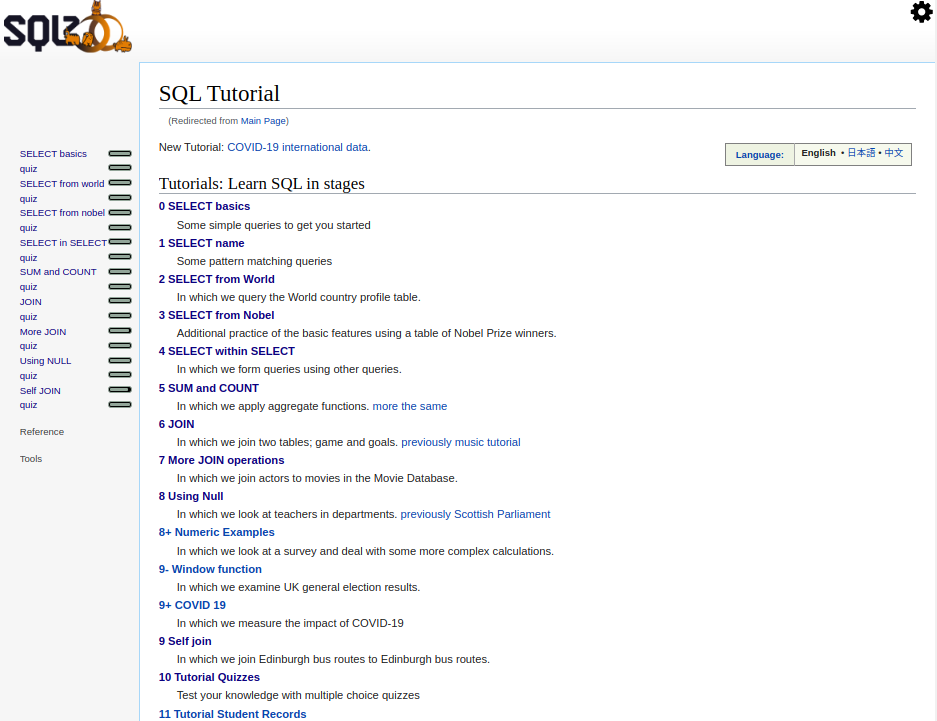

# Databases: SQL!

> On this project, I studied and learned about databases and SQL language. I completed several readings and some extra studying from videos to get the grasp of how databases work, how to interact with them, and the commands.



The goal of this project was to complete a series of challenges on the website [SQL Zoo](https://sqlzoo.net/wiki/SQL_Tutorial). This website offers a compiler and some dummy tables to work with and test your code.

## Built With

- SQL
- VSCode
- Github

## Getting Started

To get a local copy of the repository please run the following commands on your terminal:

```
$ cd <folder>
```

```
$ git clone git@github.com:lmaldonadoch/SQL_sqlzoo.git
```

## Author

👤 **Luis Angel Maldonado**

- Github: [@lmaldonadoch](https://github.com/lmaldonadoch)
- Twitter: [@LuisAngelMCh](https://twitter.com/LuisAngelMCh)
- Linkedin: [linkedin](https://www.linkedin.com/in/luis-angel-maldonado-5b503a1a3/)

## 🤝 Contributing

Contributions, issues and feature requests are welcome!

Feel free to check the [issues page](https://github.com/ferbaco86/Tic-Tac-Toe/issues).

## Show your support

Give a ⭐️ if you like this project!

## Acknowledgments

- Project inspired by Microverse Program.
- Project originally taken from [The Odin Project](https://www.theodinproject.com/courses/databases/lessons/sql)
